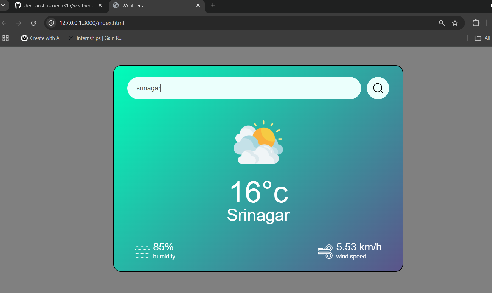

# Weather App 🌦️

A simple and clean weather web app that fetches and displays real-time weather data using the OpenWeatherMap API.

## 🚀 Live Demo

[https://deepanshusaxena315.github.io/weather-app/](https://deepanshusaxena315.github.io/weather-app/)

## 🛠 Technologies Used

- HTML
- CSS
- JavaScript
- [OpenWeatherMap API](https://openweathermap.org/api)

## 📸 Screenshot



## How to Run Locally

1. Clone this repository:
   ```bash
   git clone https://github.com/deepanshusaxena315/weather-app.git
